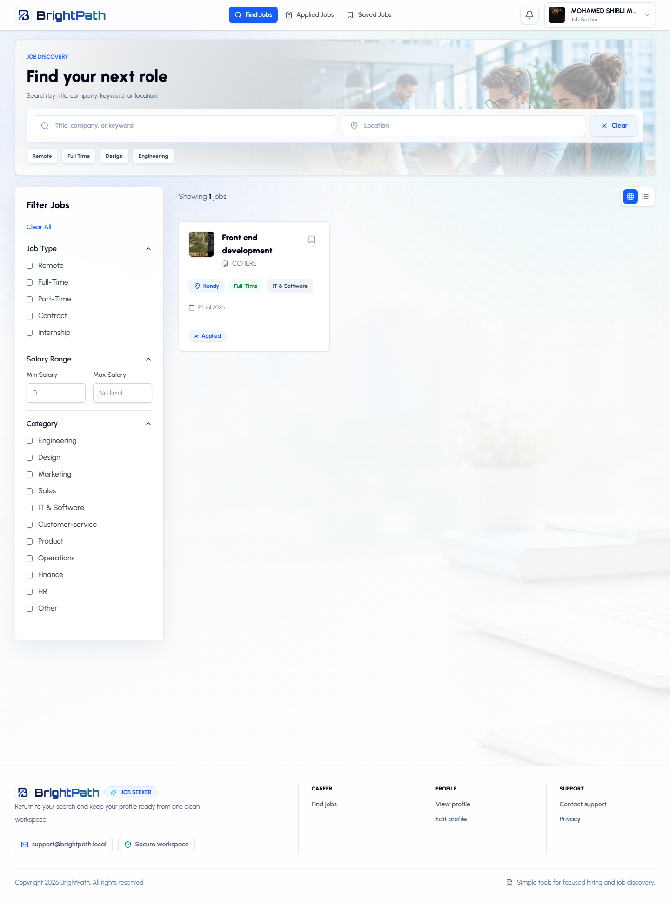
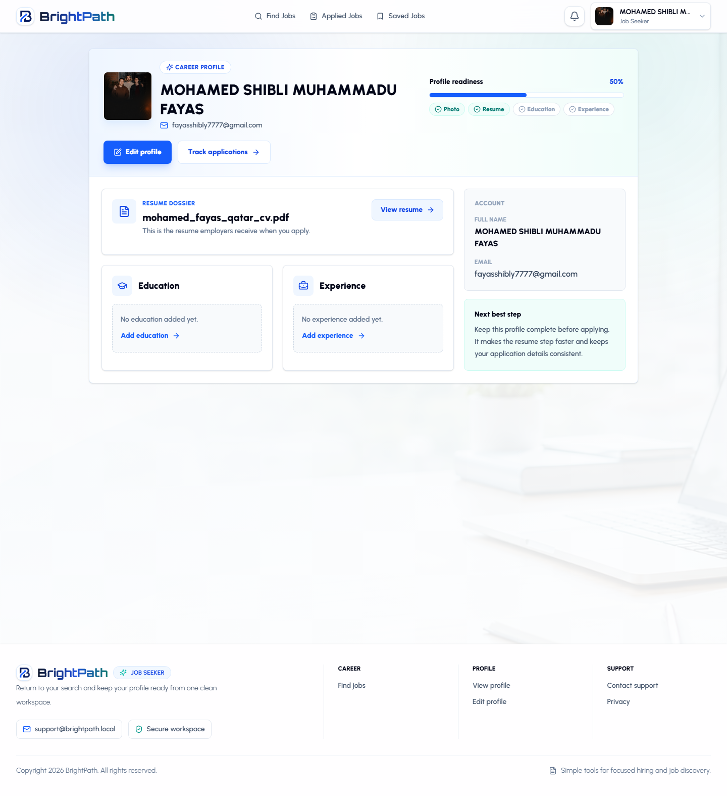
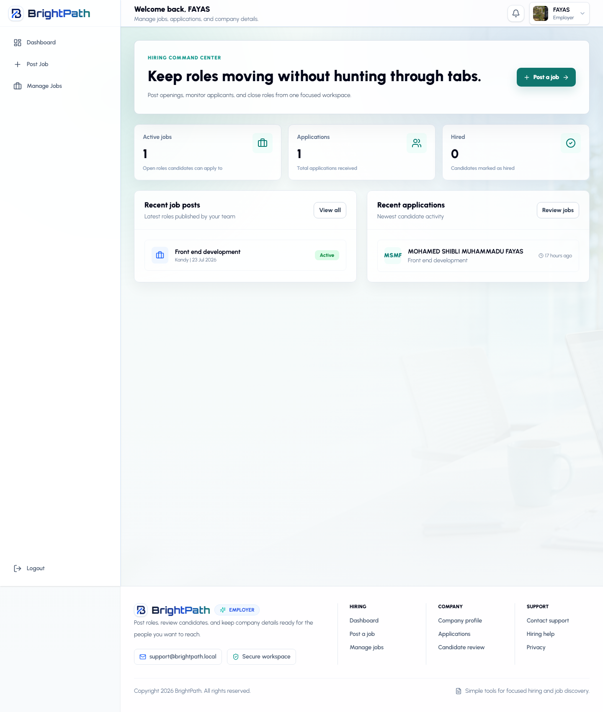
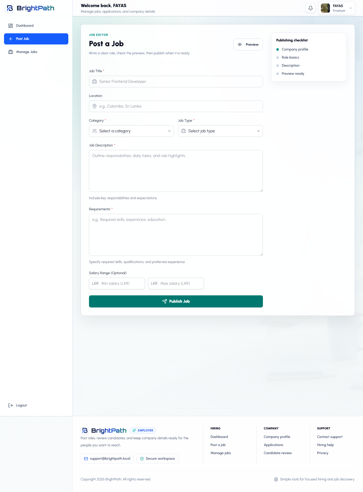
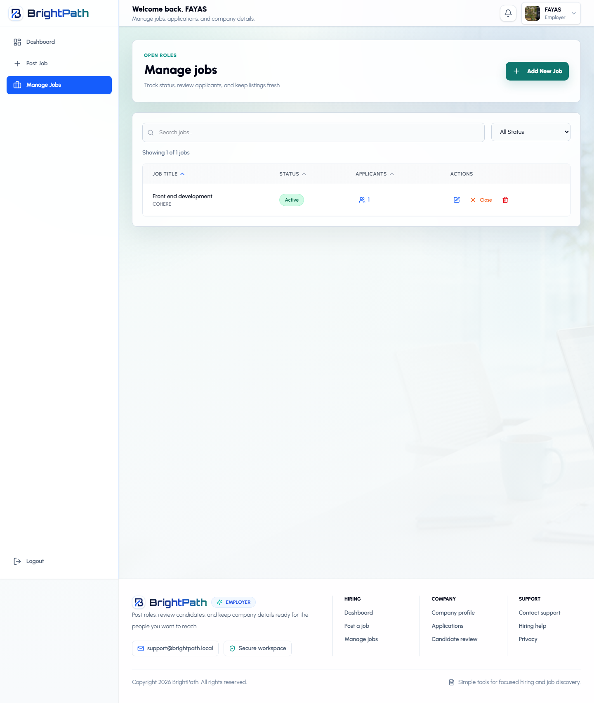
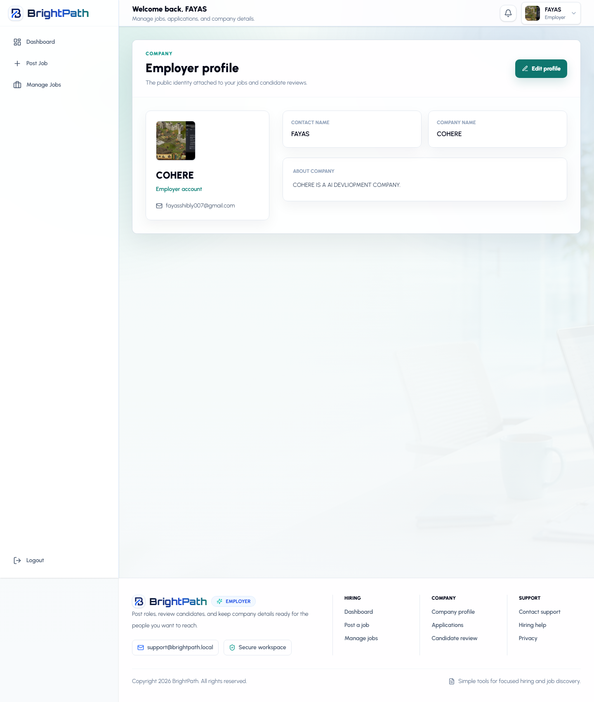
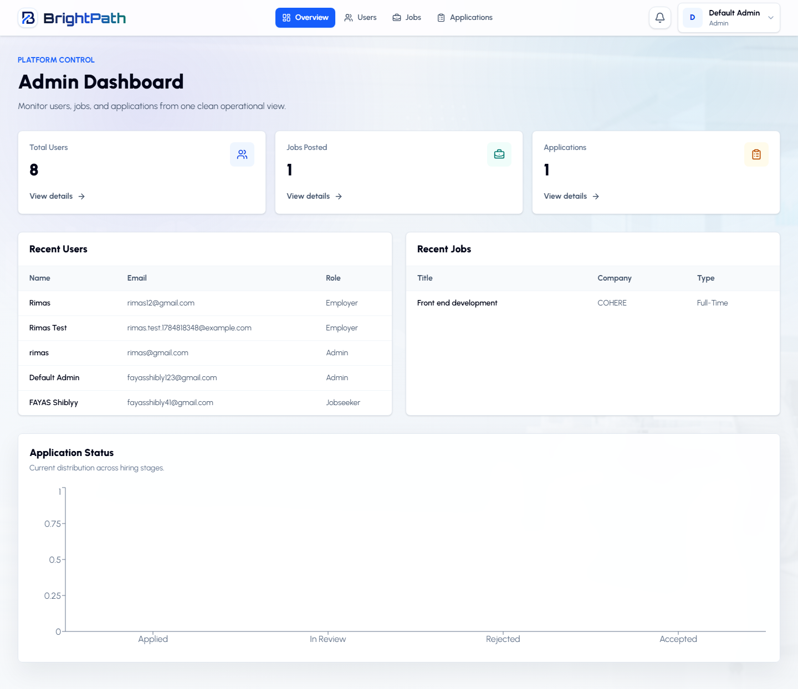
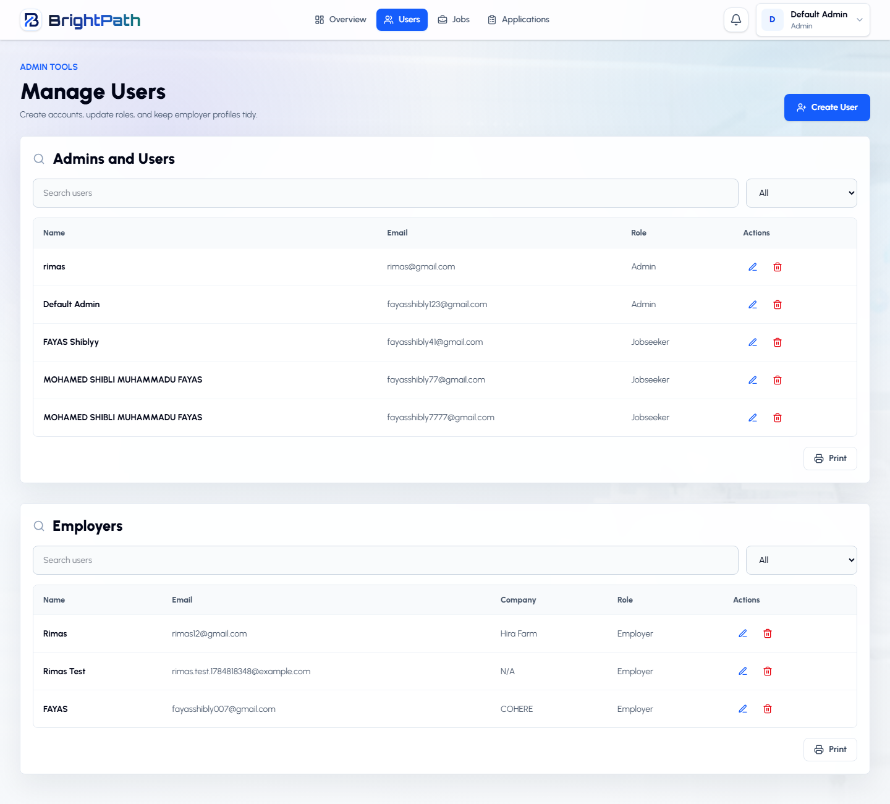
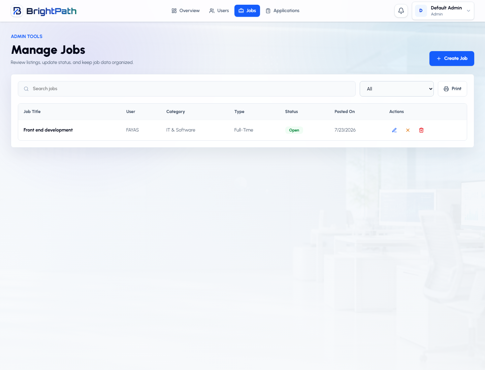
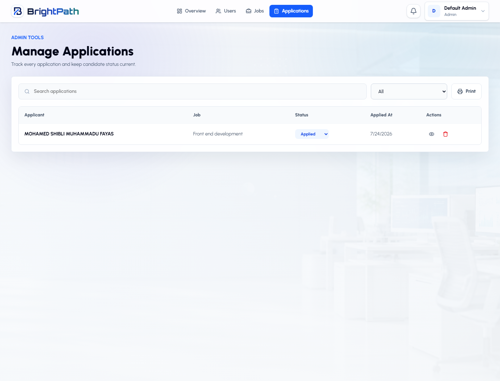

# BrightPath

BrightPath is a full stack job portal built with React and Express. It supports job seekers, employers, and admins with job discovery, applications, resume submission, saved jobs, profile management, employer job posting, applicant review, and notifications.

## Tech Stack

- Frontend: React 18, Vite, React Router, Axios, Tailwind CSS, Lucide React, Recharts
- Backend: Node.js, Express.js, MongoDB, Mongoose, JWT authentication, Multer, Nodemailer
- Database: MongoDB Atlas or local MongoDB
- Runtime uploads: profile images and resumes are stored in local `uploads` folders during development

## Project Structure

```text
BrightPathLatest/
  backend/
    config/
    controllers/
    middlewares/
    models/
    routes/
    utils/
    server.js
    .env.example
  frontend/
    job-portal/
      public/
      src/
      .env.example
      package.json
  uploads/
  .gitignore
  README.md
```

## Application Walkthrough

### Landing Page


The landing page introduces BrightPath with a clear brand, a focused message, and two direct actions: find jobs for candidates or post a job for employers. The page is designed to quickly explain the platform without making the visitor search for the next step.

### Login


The login screen keeps the flow simple for returning users. It supports role-based entry into the right workspace after authentication.

### Create Account


The registration page lets a user choose between job seeker and employer accounts. Profile image upload is optional, while required fields are validated before account creation.

### Job Seeker: Find Jobs



The job seeker workspace focuses on job discovery. Candidates can search by title, company, keyword, or location, apply filters, switch job list layout, save roles, and open job details from one place.

### Job Seeker: Profile And Resume



The profile area stores the candidate identity, resume, education, experience, skills, projects, and social links. The saved resume is used during the application flow so a candidate can apply faster without uploading the same file every time.

### Employer: Dashboard



The employer dashboard gives a quick view of posted jobs, applications, active roles, and hiring activity. It is the main starting point for managing hiring work.

### Employer: Post A Job



The job posting screen is structured so employers can publish clear roles with title, category, location, salary, description, and requirements. Employer company details are checked before posting so jobs have the right public identity.

### Employer: Manage Jobs



The manage jobs page helps employers review their posted roles, track status, and open applicants for each job. It keeps job management separate from candidate review.

### Employer: Company Profile



The employer profile represents the company-facing identity used on job posts and applicant review. Employers can update company name, description, contact details, and profile image from this area.

### Admin: Overview



The admin dashboard summarizes platform activity and gives the admin a central place to monitor users, jobs, and applications.

### Admin: Users



The users page lets admins review registered accounts across job seekers, employers, and admins. Sensitive fields such as passwords are excluded from API responses.

### Admin: Jobs



The admin jobs page provides oversight of posted jobs, including job status and employer-related information.

### Admin: Applications



The admin applications page shows submitted applications and their current review state. Submitted resumes are treated as the main application record so employer and admin review uses the resume attached at apply time.

## Environment Setup

Create a real `.env` file from the examples. Do not commit real `.env` files to GitHub.

Backend:

```bash
cd backend
copy .env.example .env
```

Frontend:

```bash
cd frontend/job-portal
copy .env.example .env
```

Backend variables:

```env
PORT=8000
MONGO_URI=your_main_mongodb_connection_string
MONGO_URI_TEST=your_test_mongodb_connection_string
JWT_SECRET=your_long_random_jwt_secret
FRONTEND_URL=http://localhost:5173
SMTP_USER=your_email@gmail.com
SMTP_PASS=your_gmail_app_password
```

Frontend variables:

```env
VITE_API_BASE_URL=http://localhost:8000
```

For Gmail SMTP, use a Gmail App Password, not your normal Gmail password.

## Install Dependencies

Install backend dependencies:

```bash
cd backend
npm install
```

Install frontend dependencies:

```bash
cd frontend/job-portal
npm install
```

## Run Locally

Start the backend:

```bash
cd backend
npm run dev
```

Start the frontend in another terminal:

```bash
cd frontend/job-portal
npm run dev
```

Local URLs:

- Frontend: `http://localhost:5173`
- Backend: `http://localhost:8000`

## Build And Check

Frontend lint:

```bash
cd frontend/job-portal
npm run lint
```

Frontend production build:

```bash
cd frontend/job-portal
npm run build
```

Backend tests:

```bash
cd backend
npm test
```

The backend tests need a reachable `MONGO_URI_TEST`.

## GitHub Upload Notes

Before pushing to GitHub, make sure these are not committed:

- `.env`
- `.env.test`
- `node_modules/`
- `dist/`
- `uploads/`
- log files

The project `.gitignore` already includes these patterns.

## Deployment Notes

Recommended simple deployment:

- Deploy backend to Render, Railway, or a similar Node.js host.
- Deploy frontend to Vercel or Netlify.
- Set backend environment variables on the backend host.
- Set `VITE_API_BASE_URL` on the frontend host to the deployed backend URL.
- Update `FRONTEND_URL` on the backend host to the deployed frontend URL.

Important: local uploads are not permanent on many hosting platforms. For a real production deployment, move resume and image uploads to Cloudinary, AWS S3, or another persistent file storage service.
